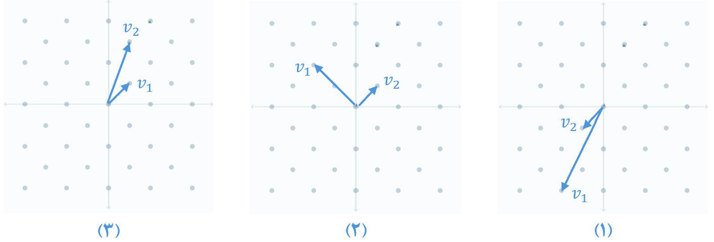
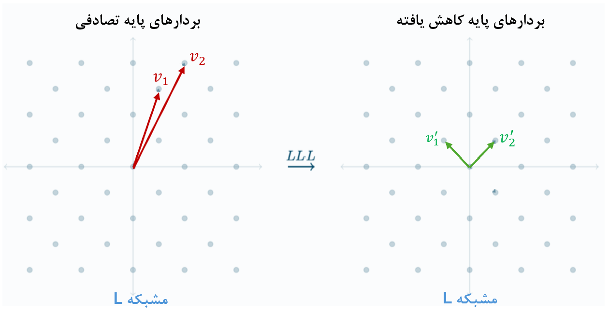
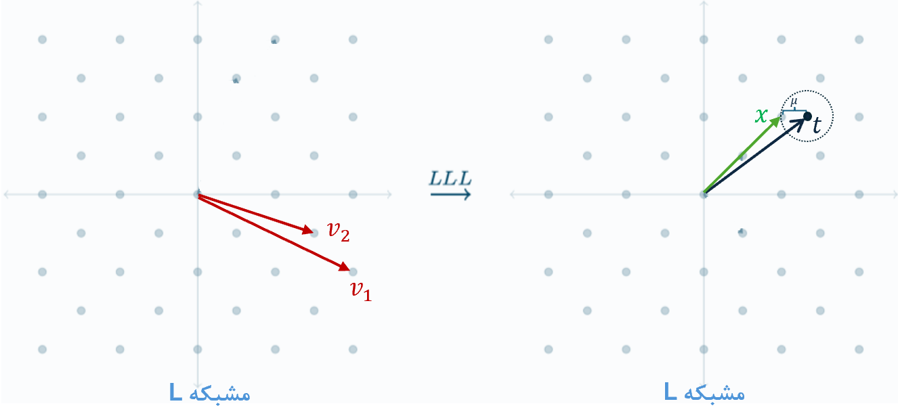

---
tags:
  - Crypto
  - Mathematical Cryptography
  - Lattice
  - LLL algorithm
---

# الگوریتم کاهش مشبکه LLL

در این مطلب قصد دارم یکی از پرکاربردترین الگوریتم‌های مورد استفاده در حل چالش‌های رمزنگاری را توضیح بدم. قبل از شروع با بگم که این الگوریتم بر پایه مفاهیم عمیق و مختلف ریاضی مثل مشبکه‌ها (Lattice)، تعامد گرام-اشمیت و الگوریتم لژاندر و غیره است که خارج بحث این نوشته است و تنها مختصر و به شکل کاردی در حل چالش‌های CTF می‌پردازم. بااین‌حال برای شروع و درک بهتر این الگوریتم با یک مقدمه و تعاریف اولیه کوتاه شروع می‌کنم.

## ۱- مقدمه

همان‌طور که می‌دانیم مشبکه n-بعدی $L$ را براساس بردارهای پایه $B=\{v_1,v_2,\ldots,v_n\}$ رسم یا نشان می‌دهند. این بردارها هرچقدر متعامدتر و کوتاه‌تر باشند به آن B، **پایه خوب** می‌گویند. 


<figure markdown="span">
  { width="500" }
</figure>

برای مثال در سه مشبکه دوبٌعدی بالا، پایه (۲) نسبت به دیگر پایه‌ها بهتر است اما بهترین پایه برای این مشبکه نیست.


## ۲- تعریف LLL: 
اول از همه تعریف الگوریتم را با دو شرط به این صورت است. 
اگر فرض کنیم $L$ یک مشبکه با پایه $B=\{v_1,v_2,\ldots,v_n\}$ باشد.  اگر الگوریتم LLL  روی  پایه B اعمال شود، پایه  متعامد Gram–Schmidt  جدید $B' = \{v'_1,v'_2,\ldots, v'_n\}$ در همان مشبکه $L$ را بدست می‌آورد که دو شرط زیر در آن صدق می‌کند:

$$
\text{1-(Size Condition)} \ \ \quad 
|\mu_{i,j}| = \frac{|v_i \cdot v_j^*|}{\|v_j^*\|^2} \le \frac{1}{2}
\quad \text{for all } 1 \le j < i \le n.
$$

$$
\text{2-(Lovász Condition)} \ \ \quad 
\|v_i^*\|^2 \ge \left( \frac{3}{4} - \mu_{i,i-1}^2 \right) \|v_{i-1}^*\|^2
\quad \text{for all } 1 < i \le n. 
$$

به بیان ساده‌تر، با الگوریتم کاهش LLL ما به دنبال این هستیم که بجای پایه B، پایه‌‌ای برای یک مشبکه پیدا کنیم که بردارهایی متعامدتر(زاویه نزدیکتر به ۹۰ درجه بین بردارها)، هم‌اندازه‌تر و کوتاه‌تر داشته باشد. 
همان‌طور که در شکل زیر نشان دادم یک مشبکه دو بٌعدی با بردارهای پایه بد بعد از اعمال الگوریتم LLL، آن‌ها را به بردارهای متعامد خوب مشبکه کاهش می‌دهد.


<figure markdown="span">
  { width="500" }
</figure>

باید توجه داشت که الگوریتم LLL **تقریب خوبی** از کوتاه‌ترین بردار می‌دهد اما پیدا کردن دقیق بهترین پایه در یک مشبکه با ابعاد بالا یک مسئله سخت (NP-hard) است.

## ۳- کاربردهای LLL

الگوریتم LLL در ریاضیات مشبکه کاربرد های زیادی دارد. 


- [**مسئله کوتاه‌ترین بردار (SVP):**](https://en.wikipedia.org/wiki/Lattice_problem)
اولین کاربرد آن که در شکل بالا آمده، حل مسئله کوتا‌ه‌ترین بردار(SVP) یا پیدا کردن بردارهای پایه خوب برای مشبکه L با تقریب قابل قبول بود. 


- [**مسئله نزدیکترین بردار (CVP):**](https://en.wikipedia.org/wiki/Lattice_problem)
مسئله نزدیک‌ترین بردار (CVP) مسئله دیگری است که مثل شکل زیر با استفاده از LLL نزدیک‌ترین بردار $x$ از مشبکه L به بردار هدف $t$ پیدا می‌کنیم به طوری که $|x-t|<\mu$    باشد. 

<figure markdown="span">
  { width="500" }
</figure>

- [**مسئله اعداد صحیح کوچک (SIS):**](https://en.wikipedia.org/wiki/Short_integer_solution_problem)
یکی دیگر از کاربردهای LLL در ریاضیات مشبکه، مسئله یافتن اعداد صحیح کوچک (SIS) در یک ترکیب خطی است که در آن ما به دنبال جواب‌های غیرصفر و کوچک هستیم. این کاربرد ادامه مفصل توضیح دادم.

!!! سوال question 
    خب حالا این مشبکه‌، بردارهای پایه، الگوریتم LLL و کاربردهای آن در SVP ،CVP و SIS چه کمکی  به ما می‌تونه بکنه؟

    جواب این سوال شاید بشه اینطوری داد که ما می‌تونیم مسئله ریاضی در چالش‌های مختلف رمزنگاری مثل معادلات جبری و... را در دنیای مشبکه‌ها وارد و در قالب این کاربردها مدل کنیم تا شاید بتونیم اون مسائل را از طریق LLL حل کنیم. در ادامه با خواندن این کاربردها و نمونه چالش‌ها، این مسئله بیشتر میشه درک کرد.


## ۴- مسئله اعداد صحیح کوچک (SIS)
 همان‌طور که گفته شد یکی از کاربردهای LLL پیدا کردن اعداد صحیح کوچک (ریشه کوچک معادله) در یک رابطه خطی یا چندجمله‌ای است که در ادامه حالات مختلف و روش حل آن‌ها را نشان دادم.

### ۱-۴ معادلات  خطی ساده
برخلاف روش دستگاه معادلات جبری که برای  بدست آوردن n مجهول نیاز به n معادله داشتیم. با استفاده از الگوریتم LLL می‌توانیم این مجهولات را با تعداد معادله کمتری (حتی یک معادله) بدست آوریم.

برای مثال هدف این الگوریتم در معادله زیر پیدا کردن جواب‌های **کوچک‌** برای مجهول‌های $x_i$ است 
که در آن $c_i$ اعداد معلوم و ثابت بزرگ هستند.   

$$
c_1 \cdot x_1 + c_2 \cdot x_2 + ... + c_n \cdot x_n  = c_{n+1}
$$


**روش حل:**
برای حل مثال زیر با سه مجهول در نظر می‌گیریم:

$$
c_1 \cdot x_1 + c_2 \cdot x_2 + c_3 \cdot x_3  = c_4
$$

گام اول : ابتدا آوردن همه متغیرها به یک سمت مساوی ($c_4$ به سمت چپ) و نمایش معادله به شکل برداری با استفاده از ماتریس‌ها:     

$$
x_1[c_1] + x_2[c_2] + x_3[c_3] + 1[-c_4] = [0]
$$

گام دوم : حالا به تعداد مجهول‌ها، معادله برداری (مثل دستگاه معادلات) به آن اضافه می‌کنیم، به طوری که مجهولات ما در بردار هدف (سمت راست) ظاهر شوند.
این کار معمولاً با اضافه کردن یک ردیف از 0ها برای حذف یک مجهول و یک 1 برای وجود مجهول به زیر معلومات $c_i$ انجام می‌شود.

- اضافه کردن اولین معادله (سطر) با درنظرگرفتن وجود $x_1$ و حذف $x_2$ و $x_3$:

$$
x_1 \cdot \begin{bmatrix} c_1 \\ 1  \end{bmatrix} + 
x_2 \cdot \begin{bmatrix} c_2 \\ 0  \end{bmatrix} + 
x_3 \cdot \begin{bmatrix} c_3 \\ 0  \end{bmatrix} + 
1  \cdot \begin{bmatrix} -c_4 \\ 0  \end{bmatrix} =
\begin{bmatrix} 0 \\ x_1  \end{bmatrix}
$$

- اضافه کردن دومین معادله (سطر) با درنظرگرفتن وجود $x_2$ و حذف $x_1$ و $x_3$:

$$
x_1 \cdot \begin{bmatrix} c_1 \\ 1 \\0 \end{bmatrix} + 
x_2 \cdot \begin{bmatrix} c_2 \\ 0 \\1 \end{bmatrix} + 
x_3 \cdot \begin{bmatrix} c_3 \\ 0 \\0 \end{bmatrix} + 
1  \cdot \begin{bmatrix} -c_4 \\ 0 \\0 \end{bmatrix} =
\begin{bmatrix} 0 \\ x_1 \\ x_2  \end{bmatrix}
$$

- اضافه کردن سومین معادله (سطر) با درنظرگرفتن وجود $x_3$ و حذف $x_2$ و $x_1$:

$$
x_1 \cdot \begin{bmatrix} c_1 \\ 1 \\ 0 \\ 0 \end{bmatrix} + 
x_2 \cdot \begin{bmatrix} c_2 \\ 0 \\ 1 \\ 0 \end{bmatrix} + 
x_3 \cdot \begin{bmatrix} c_3 \\ 0 \\ 0 \\ 1 \end{bmatrix} + 
1  \cdot \begin{bmatrix} -c_4 \\ 0 \\ 0 \\ 0 \end{bmatrix} =
\begin{bmatrix} 0 \\ x_1 \\ x_2 \\ x_3 \end{bmatrix}
$$

 حالا که تمام معادله‌های مورد نیاز تکمیل شد می‌توانیم مشبکه‌ی پایه بد (ماتریس سمت چپ) زیر بسازیم. سپس  با الگوریتم LLL آن را کاهش دهیم تا پایه‌ی خوب (بردار هدف سمت راست) که همان جواب موردنظر ماست را پیدا کنیم.
باید توجه داشته که ممکن است جواب‌ الگوریتم LLL یکتا نباشد و باید به دنبال بردار هدف که درایه اول آن 0 است بگردیم.

$$
\begin{bmatrix}
    c_1 &  c_2 &  c_3 & -c_4 \\
    1   &   0  &   0  &   0   \\
    0   &   1  &   0  &   0   \\
    0   &   0  &   1  &   0
\end{bmatrix} \ \underrightarrow{LLL} \ \begin{bmatrix} 0 \\ x_1 \\ x_2 \\ x_3 \end{bmatrix}
$$

!!! نکته۱ info
    به دلیل نوع برنامه‌نویسی sage، باید نوع ماتریسی که ساختیم را به شکل ترانهاده (جابجایی سطر و ستون) با دستور `()transpose.` یا `T.`بنویسیم. همچنین جواب کاهش‌یافته نیز به فرم سطری $[0,x_1,x_2,x_3]$ خواهد بود.


!!! نکته۲ info
    اگه تعداد مجهولات بیشتری در یک معادله داشته باشیم. آیا باز هم LLL جواب میده؟ پاسخ آره است. مثال زیر یک مشبکه 3 و 9 بٌعدی دو معادله با 3 و 9 مجهول را حل کردیم. الگوریتم LLL از دید نظری برای حل یک معادله با هر ابعادی (n) تعریف شده و حد بالای دقیقی برای آن وجود ندارد و به سیستم شما بستگی دارد، 
    
    همچنین، باید اندازه مجهولات $x_i$ نسبت به هم نزدیک و هم مقیاس باشند و نسبت به اندازهٔ ضرایب $c_i$ به‌قدر کافی کوچک باشد تا بردار متناظر با پاسخ کوتاه‌تر از بردارهای دیگر شبکه باقی بماند.


 دو نمونه کد زیر جواب دو معادله را با تعداد $x_i$ متفاوت با استفاده از LLL بدست می‌آورد.


<div class="grid cards" markdown>

-   مثال: با ۹ مجهول

    ---

    ```py linenums="1"
    from sage.all import *
    from random import randint

    xs= [randint(0,2**100) for i in range(9)]  # unknowns

    print(xs)

    cs= [randint(0,2**1000) for i in range(9)]  # knowns

    c10 = sum(c * x for c, x in zip(cs, xs))

    # Construct matrix
    M=matrix(cs).stack(identity_matrix(9)).augment(vector([-c10]+ [0]*9)) 
    M=M.T

    M=M.LLL()
    for row in M:
        if row[0] == 0:
            print(row)
    ```

-   مثال: با ۳ مجهول

    ---

    ```py linenums="1"

    from sage.all import *
    from random import randint
      x1=randint(0,2**100)    # unknowns
      x2=randint(0,2**100)
      x3=randint(0,2**100)

      c1=randint(0,2**1000)
      c2=randint(0,2**1000)
      c3=randint(0,2**1000)

      c4 = c1*x1 + c2*x2 + c3*x3

      M=Matrix([
        [c1, c2, c3, -c4],
        [ 1,  0,  0,   0],
        [ 0,  1,  0,   0],
        [ 0,  0,  1,   0],
      ]).T

      M=M.LLL()
      for row in M:
          if row[0] == 0:
              print(row)
    ```
</div>

!!! نکته۳ info 
    به خاطر اینکه جمع خاصیت جابه‌جاپذیری را دارد می‌توانیم سطر ها و ستون‌های ماتریس را مانند زیر جابه‌جا کنیم. 
    
    در **جابجایی ستون** درایه‌های جواب تغییری نمی‌کند.

    $$
    \begin{bmatrix}
    c_2 &  c_1 &  c_3 & -c_4 \\
    0   &   1  &   0  &   0   \\
    1   &   0  &   0  &   0   \\
    0   &   0  &   1  &   0
    \end{bmatrix}= \begin{bmatrix} 0 \\ x_1 \\ x_2 \\ x_3 \end{bmatrix}
    $$ 

    اما در **جابه‌جایی سطر** درایه‌های بردار جواب جابه‌جا می‌شود
    
    $$
    \begin{bmatrix}
    1   &   0  &   0  &   0   \\
    c_1 &  c_2 &  c_3 & -c_4 \\
    0   &   1  &   0  &   0   \\
    0   &   0  &   1  &   0
    \end{bmatrix}= \begin{bmatrix} x_1 \\ 0 \\ x_2 \\ x_3 \end{bmatrix}
    $$


!!! توجه warning 
    توجه کنید که LLL تنها به مقدار مجهول‌ها توجه می کند و به علامت مثبت یا منفی آن اهمیتی نمی‌دهد. بنابراین باید هردو را چک کنید


برای مثال مسابقه‌های CTF از این نوع معادله‌ها رایتاپ چالش  [basic_LLL](https://writeups.fmc.tf/crypto/writeups/2025/L3akCTF/Basic_LLL/)  و [trendy windy trigonity](https://writeups.fmc.tf/crypto/writeups/2024/CyberSpaceCTF/trendy_windy_trigonity/) مطالعه کنید.

####  چندین معادله خطی

برای مواردی که تعداد معادلات بیشتر می‌شوند به طورکلی شیوه کار مانند قبل است با اندکی تفاوت. دو معادله زیر درنظر بگیرید:

$$
c_1 \cdot x_1 + c_2 \cdot x_2  = c_3 \\
d_1 \cdot y_1 + d_2 \cdot y_2  = d_3
$$

 که در اینجا $y_i$ و $x_i$ مجهول‌ها و $c_i$ و $d_i$معلومات هستند. مانند قبل همه مقادیر را به سمت چپ می‌بریم و به شکل ماتریسی می‌نویسیم.


$$
x_1[c_1] + x_2[c_2] + 1[-c_3] = [0] \\
y_1[d_1] + y_2[d_2] + 1[-d_3] = [0]
$$

حال هر معادله به صورت مخلوطی از هردو مجهول (ضریب 0 هیچ تاثیری ندارد) به شکل زیر می‌نویسیم. مقادیر [0]در عمل تاثیری بر  هر معدله ندارند و تنها برای درک بهتر است.

$$
x_1 [c_1] + x_2 [c_2] + y_1 [0] + y_2 [0] + 1 [-c_3] = [0] \\
x_1 [0]   + x_2 [0]   + y_1 [d_1] + y_2 [d_2] + 1 [-d_3] = [0]
$$

که با ترکیب دو معادله یک معادله ماتریسی به شکل زیر خواهیم داشت.

$$
\small
x_1 \begin{bmatrix} c_1 \\ 0  \end{bmatrix} + 
x_2 \begin{bmatrix} c_2 \\ 0  \end{bmatrix} + 
y_1 \begin{bmatrix} 0 \\ d_1  \end{bmatrix} +
y_2  \begin{bmatrix} 0 \\ d_2  \end{bmatrix} +
1  \begin{bmatrix} -c_3 \\ -d_3  \end{bmatrix} =
\begin{bmatrix} 0 \\ x_1  \end{bmatrix}
$$

حالا مثل حالت  تک معادله‌ای، باید با اضافه کردن ردیف‌های شامل 0ها با یک 1 به زیر معلومات انجام دهیم تا بردار هدف سمت راست بسازیم. در اینجا دیگه مرحله به مرحله اضافه نکردم و تنها معادله ماتریسی نهایی را نوشتم:


$$
\small
x_1 \begin{bmatrix} c_1 \\ 0 \\ 1 \\ 0  \\ 0 \\ 0 \end{bmatrix} + 
x_2  \begin{bmatrix} c_2 \\ 0 \\ 0 \\ 1 \\ 0 \\ 0 \end{bmatrix} + 
y_1  \begin{bmatrix} 0 \\ d_1 \\ 0 \\ 0 \\ 1 \\ 0 \end{bmatrix} + 
y_2 \begin{bmatrix}  0 \\ d_2 \\ 0 \\ 0  \\ 0 \\ 1 \end{bmatrix} +
1    \begin{bmatrix} -c_3 \\ -d_3 \\ 0 \\ 0 \\ 0 \\ 0  \end{bmatrix}=
\begin{bmatrix} 0 \\ 0 \\ x_1 \\ x_2 \\ y_1 \\ y_2 \end{bmatrix}
$$

پس ماتریس مشبکه و بردار هدف آن برای دو معادله یه شکل خواهد بود:

$$
\begin{bmatrix}
    c_1 & c_2  &  0   &  0  & -c_3 \\
    0   &  0   & d_1  & d_2 & -d_3 \\
    1   &  0   &  0   &  0  &  0   \\
    0   &  1   &  0   &  0  &  0   \\
    0   &  0   &  1   &  0  &  0   \\
    0   &  0   &  0   &  1  &  0   \\
\end{bmatrix}= \begin{bmatrix} 0 \\ 0 \\ x_1 \\ x_2 \\ y_1 \\ y_2  \end{bmatrix}
$$

کد زیر یک مثال با مجهولات بیشتر $y_1,y_2,y_3$ و $x_1,x_2,x_3$ را با استفاده LLL بدست می‌آورد. بعد از اعمال آن باید به دنبال سطری باشیم که دو درایه اول آن 0 باشد.

```py linenums="1"
from sage.all import *
from random import randint

x1 = randint(0, 2**100)     # Generate random unknowns
x2 = randint(0, 2**100)
x3 = randint(0, 2**100)
y1 = randint(0, 2**100)
y2 = randint(0, 2**100)
y3 = randint(0, 2**100)

print(f'x1 = {x1}\n x2 = {x2}\n x3 = {x3}')
print(f'y1 = {y1}\n y2 = {y2}\n y3 = {y3}')

c1 = randint(0, 2**1000)  # Generate random coefficients (knowns)
c2 = randint(0, 2**1000)
c3 = randint(0, 2**1000)
d1 = randint(0, 2**1000)
d2 = randint(0, 2**1000)
d3 = randint(0, 2**1000)

c4 = c1*x1 + c2*x2 + c3*x3
d4 = d1*y1 + d2*y2 + d3*y3

M = Matrix([
    [c1, c2, c3,  0,  0,  0, -c4],
    [ 0,  0,  0, d1, d2, d3, -d4],
    [ 1,  0,  0,  0,  0,  0,   0],
    [ 0,  1,  0,  0,  0,  0,   0],
    [ 0,  0,  1,  0,  0,  0,   0],
    [ 0,  0,  0,  1,  0,  0,   0],
    [ 0,  0,  0,  0,  1,  0,   0],
    [ 0,  0,  0,  0,  0,  1,   0]
]).T

M = M.LLL()
for row in M:
    if row[0]==0 and row[1]== 0: # we are looking for a row with two 0 in first 
        print(row)
```


### ۲-۴ معادلات خطی پیمانه‌ای

با الگوریتم LLL معادلات همنهشتی یا پیمانه‌ای $a \equiv b \ (mod \ n)$ هم را می‌توان **با اندکی تفاوت** حل کرد. این معادلات به سادگی تبدیل به معادله خطی  $a=b+k \cdot n$ می‌شوند. مثلا معادله زیر را در نظر بگیرید:

$$
c_1 \cdot x_1 + c_2 \cdot x_2   \equiv  c_3\ mod \ n 
$$

که بعد از جابه‌جایی متغیرها به  سمت چپ و تبدیل  معادله همنهشتی به خطی  به شکل زیر در می‌آید:

$$
c_1 \cdot x_1 + c_2 \cdot x_2 - c_3 + k \cdot n = 0 
$$

سپس با اضافه کردن ردیف‌های 0 و 1 به زیر معادله برای مجهولات $x_i$ مانند قبل، آن را تبدیل معادلات برداری زیر می‌کنیم::

$$
x_1 \cdot \begin{bmatrix} c_1 \\ 1 \\0 \end{bmatrix} + 
x_2 \cdot \begin{bmatrix} c_2 \\ 0 \\1 \end{bmatrix} +  
1  \cdot \begin{bmatrix} -c_3 \\ 0 \\0 \end{bmatrix} +
k  \cdot \begin{bmatrix}    n \\ 0 \\0 \end{bmatrix} =
\begin{bmatrix} 0 \\ x_1 \\ x_2   \end{bmatrix}
$$

اما تفاوت معادلات پیمانه‌ای اینجاست که دو ستون $\begin{bmatrix} -c_3 \\ 0 \\0 \end{bmatrix}$ و $\begin{bmatrix} n \\ 0 \\0 \end{bmatrix}$  ساختار یکسان دارند و باید تغییر کنند. پس دو ردیف باید به آن ها اضافه شود، اما با چه عددی؟
برای اینکه ضرایب مجهول k را در بردار هدف نداشته باشیم پس دو ردیف آخر بردار هدف را با عدد 1 پر می‌کنیم:

$$
x_1 \cdot \begin{bmatrix} c_1 \\ 1 \\0 \\ 0 \\ 0 \end{bmatrix} + 
x_2 \cdot \begin{bmatrix} c_2 \\ 0 \\1 \\ 0 \\ 0 \end{bmatrix} + 
1  \cdot \begin{bmatrix} -c_4 \\ 0 \\0 \\ ? \\ 0 \end{bmatrix} +
k  \cdot \begin{bmatrix}    n \\ 0 \\0 \\ 0 \\ ? \end{bmatrix} =
\begin{bmatrix} 0 \\ x_1 \\ x_2 \\ 1 \\ 1 \end{bmatrix}
$$

حال مقدار ؟ را در بردارها براساس مقدار متناضرشان در بردار هدف با استفاده از این دو $1 \cdot ?=1$ and $k \cdot ?=1$ حل می کنم. واضح است که مقدار برای بردار اول 1 و برای دوم $1/k$ استفاده کنیم.اما چون مقدار k نمیدانیم و چون $0<k<n$ پس می‌توانیم بجای $1/k$ از $1/n$ استفاده کنیم:

$$
x_1 \cdot \begin{bmatrix} c_1 \\ 1 \\0 \\ 0 \\ 0 \end{bmatrix} + 
x_2 \cdot \begin{bmatrix} c_2 \\ 0 \\1 \\ 0 \\ 0 \end{bmatrix} +  
1  \cdot \begin{bmatrix} -c_3 \\ 0 \\0 \\ 1 \\ 0 \end{bmatrix} +
k  \cdot \begin{bmatrix}    n \\ 0 \\0  \\ 0 \\ 1/n \end{bmatrix} =
\begin{bmatrix} 0 \\ x_1 \\ x_2 \\ 1 \\ 1 \end{bmatrix}
$$

در نهایت ماتریس  مشبکه و بردار هدف برای حل با LLL به شکل زیر خواهد بود.


$$
\begin{bmatrix}
    c_1 &  c_2 &  -c_3 &  n   \\
    1   &   0  &   0   &  0   \\
    0   &   1  &   0   &  0   \\
    0   &   0  &   1   &  0   \\
    0   &   0  &   0   &  1/n \\
\end{bmatrix} \ \underrightarrow{LLL} \ \begin{bmatrix} 0 \\ x_1 \\ x_2  \\ 1 \\ k/n \end{bmatrix}
$$


```py title="مثال معادله پیمانه‌ای" linenums="1"  
from sage.all import *
from random import randint

n= 2**500
x1=randint(0,2**100)  # unknowns
x2=randint(0,2**100)
print(f'x1 = {x1}, x2 = {x2}')
c1=randint(0,n)      # knowns
c2=randint(0,n)

c3 = (c1*x1 + c2*x2 ) % n

M=Matrix([
[c1, c2, -c3,  n],
[ 1,  0,   0,  0],
[ 0,  1,   0,  0],
[ 0,  0,   1,  0],
[ 0,  0,   0,  QQ(1)/n],
]).T

M=M.LLL()
for row in M:
    if row[0] == 0:
        print(row)
```

برای مثال از مسابقات CTF در مورد این معادله‌ها پیمانه‌ای رایتاپ [51prime](https://writeups.fmc.tf/crypto/writeups/2024/TCP1P/51prime/) مطالعه کنید. 


####  چندین معادله پیمانه‌ای

  همچنین معادله‌های پیمانه‌ای که به فرم زیر هستند نیز با LLL قابل حل هستند.

$$
c_1 \cdot x +  y_1 + a1   \equiv  0 \  \  mod \ n  \\
c_2 \cdot x +  y_2 + a2   \equiv  0 \  \  mod \ n
$$

  به‌طور خلاصه ماتریس مشبکه‌ برای این نوع معادله‌ها و بردار هدف آن به شکل زیر است:

$$
\begin{bmatrix}
    1   &  0   &   0   &  0   \\
    0   &   1  &   0   &  0   \\
    a1  &  c1  &   n   &  0   \\
    a2  &  c2  &   0   &  n   \\
\end{bmatrix} \ \underrightarrow{LLL} \ \begin{bmatrix} 1 \\ x \\ y_1  \\ y_2 \\  \end{bmatrix}
$$

هرچه معادله بیشتری داشته باشیم، سطر زیر ماتریس اضافه می‌شود که در مثال زیر داریم.


```py title="مثال  چند معادله پیمانه‌ای" linenums="1"  
from sage.all import *
from random import randint

n= 2**500
x=randint(0,2**100)  # unknowns

y1=randint(0,2**100)
y2=randint(0,2**100)
y3=randint(0,2**100)
print(f'x = {x}, y1 = {y1}, y2 = {y2}, y3 = {y3}')

c1=randint(0,n)      # knowns
c2=randint(0,n)
c3=randint(0,n)

a1 = (- (c1*x + y1)) % n
a2 = (- (c2*x + y2)) % n
a3 = (- (c3*x + y3)) % n

M=Matrix([
    [  1,   0,  0,  0, 0],
    [  0,   1,  0,  0, 0],
    [ a1,  c1,  n,  0, 0],
    [ a2,  c2,  0,  n, 0],
    [ a3,  c3,  0,  0, n],
]).T
M=M.LLL()
for row in M.rows():
    if abs(row[0]) == 1:
        print(row)
```

### ۳-۴ مسئله جمع زیرمجموعه‌ها  

فرض کنید لیستی از اعداد صحیح مثبت $m=(m_1, m_2,..., m_n)$ و یک عدد صحیح دیگر $S$ به شما داده شده است. مسئله پیدا کردن زیرمجموعه‌ای از عناصر $m$ که مجموع آنها $S$ باشد را مسئله جمع زیرمجموعه‌ها گویند. که یک مسئله نسبتا دشوار در اعداد بزرگ است.
برای مثال در مجموعه $m =(2,3,4,9,14,23)$ و $S = 21$ باشد. در می‌یابیم که زیرمجموعه $\{3,4,14\}$ مجموع 21 را دارد.
حال بیان ریاضی مسئله جمع زیرمجموعه‌ها بصورت زیر است:

$$
S=\sum_{i=1}^{n} x_i \cdot m_i \ \ , \ \ \ \ \ x_i \in \{0,1\}
$$

اگر این سیگما را باز کنیم متوجه می‌شویم که این همان معادله خطی است که ما در بالا  با استفاده از LLL حل کردیم. تنها تفاوت در مسئله جمع زیرمجموعه‌ها با معادله خطی این است که مقدار مجهول $x_i$ آن تنها می‌تواند اعداد 0 یا 1 باشد.


#### شکستن رمزنگاری مرکل-هلمن 

رمزنگاری [Merkle-Hellman knapsack](https://en.wikipedia.org/wiki/Merkle%E2%80%93Hellman_knapsack_cryptosystem) یک روش رمزنگاری  نامتقارن براساس مسئله جمع زیرمجموعه‌ها است.
این رمزنگاری همچنین با نوع خاصی از مجموعه‌ها به نام مجموعه اَبَرافزایشی (superincreasing) که هر عنصر $m_i$ در آن از مجموع کل عناصر قبلی آن بزرگتر است کار می‌کند.  این رمزنگاری بعد از ارائه الگوریتم LLL که به شکستن و کشف پیام بدون نیاز به کلید خصوصی کمک کرد از رده خارج شد. در زیر کد مربوط به حل چالش رمزنگاری کوله‌پشتی از سایت  [cryptohack](https://cryptohack.org/challenges/post-quantum/) آمده است.


```py linenums="1"
from Crypto.Util.number import long_to_bytes
from sage.all import *

x = [...,...,...]
S =  45690752833299626276860565848930183308016946786375859806294346622745082512511847698896914843023558560509878243217521
n = len(x)
M = identity_matrix(n).augment(vector(x)).stack(vector([-1/2]*n + [-S]))

for row in M.LLL():
    try:
        row = [str(int((i+1/2))) for i in row[:-1]]
        flag = long_to_bytes(int("".join(row)[::-1], 2))
        print(flag.decode())
    except:
        continue
```

!!! توجه warning 
    به دلیل بزرگ بودن اعداد و ابعاد در این چالش، روش LLL معمولی برای این سوال کند است که برای بهینه شدن، سطر آخر ماتریس مقدار $1/2$ دارد که می‌توانید برای دلیل آن و جزئیات بیشتر به فصل ۷ کتاب [Hoffstein](https://writeups.fmc.tf/crypto/source/) مراجعه کنید. همچنین در کد بالا ماتریس مشبکه به شکل از قبل ترانهاده ساخته شده است.  


###  ۴-۴ چندجمله‌ای تکین

در معادله چندجمله‌ای‌ تکین (monic) زیر (چندجمله‌ای که ضریب اولین متغیر یک است) با شرط کوچک بودن ریشه $x_0$ معادله (یعنی $\left| x_0 < N^{1/d} \right|$) می‌توان آن ریشه  را با روش coppersmith پیدا کرد که در آن $f(x_0)\equiv 0 \ (mod \ N)$ باشد. 


$$
f(x) = x^{d} + a_{d-1}.x^{d-1} + \cdots + a_{1}.x + a_{0} \ \ \ mod \ N ,
\qquad a_i \in \mathbb{Z}.
$$

الگوریتم coppersmith با استفاده از LLL این معادله حل می‌کند که به دلیل پیچیدگی ساخت ماتریس مشبکه آن  وارد جزئئیات نمی شوم و علاقمندان می‌توانند به این [کتاب](https://www.taylorfrancis.com/books/mono/10.1201/b11066/lattice-basis-reduction-murray-bremner) مراجعه کنند. 
در sage برای حل این معادلات و بدست آوردن ریشه معادله، تابع  `small_roots` وجود دارد که در مثال زیر آمده است. 

```py title="مثال  چندجمله‌ای تکین" linenums="1"  

from random import randint
from sage.all import *

N = randint(2**256, 2**257)
x0 = 1234432195951612789980107  # smaller than N^(1/3)

P.<x> = PolynomialRing(Zmod(N)) # Build cubic polynomial in N

f = (x - x0)**3     # f = x^3 - 3*x^2*x0 + 3*x*x0^2 - x0^3
f = f.monic()   # ensure monic polynomial

# Coppersmith parameters
beta = 1/3    # for cubic case
epsilon = 0.01
X = floor(N**(1/3) / 4)   # bound on |x0|, safe margin

roots = f.small_roots(X=X, beta=beta, epsilon=epsilon)
print("\nRecovered roots:",roots)
```

!!! نکته۴ info 
    مثلا سری‌های توانی به شکل $\sum_{i=1}^{n} c_i.x^i$  قابل حل نیستند چون هم پیمانه‌ای نیستند و هم مقدار اولین ضریب $c_1$ همیشه یک نیست. 

برای مثال از این معادله در یک مسابقه CTF می‌توانید به چالش [brainrot13](https://writeups.fmc.tf/crypto/writeups/2025/UMDCTF/brainrot13/) مراجعه کنید.


### ۵-۴ معادلات یادگیری با خطا

معادلات یادگیری با خطا (learning with Error) بصورت زیر است که در آن مقدار $e$ یک بردار تصادفی است 

$$
b \equiv A \cdot s +e \ (mod \ p) \\
b - A \cdot s \equiv e \ (mod \ p) \\
b - A \cdot s = e + \ k \cdot p 
$$

در صورت خیلی کوچک بودن مقدار خطا $(\left| e \right| \ll p)$ می‌توان این معادلات را با LLL به صورت زیر حل کنیم: 

$$
1 \begin{bmatrix}   b_1     \\    b_2  \\ \vdots \\ b_n     \end{bmatrix} - 
s_{0}  \begin{bmatrix} A_{1,1} \\ A_{2,1} \\ \vdots \\ A_{m,1} \end{bmatrix} -
 \cdots -
s_{n}  \begin{bmatrix} A_{1,n} \\ A_{2,n} \\ \vdots \\ A_{m,n} \end{bmatrix} +
k_{1}  \begin{bmatrix}   p     \\    0   \\ \vdots \\   0     \end{bmatrix} + 
 \cdots +
k_{m}  \begin{bmatrix}   0     \\    0   \\ \vdots \\   p     \end{bmatrix} =
\begin{bmatrix} e_1   \\ e_2 \\ \vdots \\   e_m   \end{bmatrix}
$$

که شکل ماتریس آن به صورت زیر خواهد شد:

$$
\begin{bmatrix}
    b_1    &  A_{1,1}  &  A_{1,2} &  \cdots & A_{1,n} &  p     &  0     & \cdots &   0 \\
    b_2    &  A_{2,1}  &  A_{2,2} &  \cdots & A_{2,n} &  0     &  p     & \cdots &   0 \\
    \vdots &  \vdots   &  \vdots  &  \ddots & \vdots  & \vdots & \vdots & \ddots &  \vdots \\
    b_m    &  A_{m,1}  &  A_{m,2} &  \cdots & A_{m,n} &  0     &  0     & \cdots &   p \\
\end{bmatrix} \ \underrightarrow{LLL} \ \begin{bmatrix} e_1   \\ e_2 \\ \vdots \\   e_m   \end{bmatrix}
$$


```py title="LWE مثال  معادلات" linenums="1"  
from sage.all import *

p = 1361
m = 50  # number of equations
n = 30  # dimension of secret vector

A = random_matrix(GF(p), m, n)
s = random_vector(GF(p), n)
e = vector([randint(-1, 1) for _ in range(m)])
b = A * s + e
print(f'e = {e}')

b = b.change_ring(ZZ)
M = (Matrix(b).T
    .augment(A)
    .augment(diagonal_matrix(m * [p]))
    .T
)

M = M.LLL()
for row in M:
    if row==e:
        print("\nLLL-reduced:", row)
        break
``` 

!!! نویسنده
    [HIGHer](https://github.com/HIGH0101)